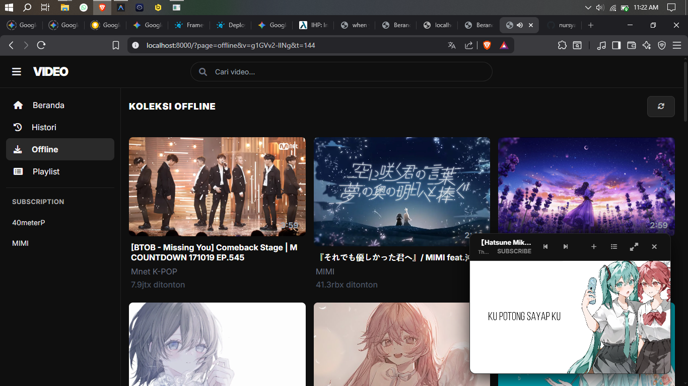

# 🎥 Video Studio - YT-Offline Streamer

Aplikasi streaming video YouTube lokal dengan fitur caching otomatis, pengaturan playlist, dan manajemen koleksi offline.

## ✨ Fitur Unggulan
- **Caching Otomatis**: Nonton sekali, selanjutnya bisa ditonton offline (hemat kuota).
- **Smart Timestamp**: Melanjutkan tontonan tepat di detik terakhir (fitur resume).
- **Smart Search**: Pencarian cepat dengan saran otomatis (suggestions).
- **Playlist Management**: Buat koleksi lagu/video favorit tanpa login akun Google.
- **Lightweight & Fast**: Dibangun dengan FastAPI dan vanilla JS, sangat ringan untuk PC.
- **Auto-Quality**: Default download di kualitas 360p/480p untuk menghemat ruang disk.

## 🚀 Cara Menjalankan
Cukup double-klik file **`Start-Video-Studio.bat`** di folder utama. 
Script ini akan otomatis:
1. Menjalankan server backend.
2. Mencari port yang tersedia secara otomatis.
3. Membuka browser favorit Anda.

## ⌨️ Shortcut Keyboard Player
- **Spasi**: Play / Pause
- **f**: Layar Penuh (Fullscreen)
- **m**: Mute / Unmute
- **Panah Kanan**: Maju 5 detik
- **Panah Kiri**: Mundur 5 detik
- **p**: Buka/Tutup Playlist di dalam player

## 🛠️ Persyaratan Sistem
- Windows 10/11
- Python 3.9+
- Koneksi Internet (hanya untuk pengambilan video pertama kali)

## 📸 Screenshot

---
*Dibuat dengan ❤️ untuk pengalaman menonton yang lebih bebas iklan dan hemat kuota.*
